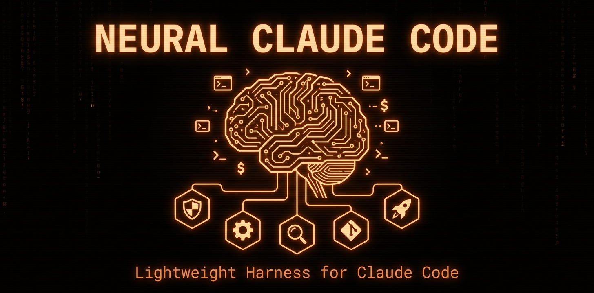

# Neural Claude Code

<p align="center">
  
</p>

<p align="center">
  
  
  
  
</p>

<p align="center">
  <strong>Lightweight harness for Claude Code. Security hooks, dev pipeline, smart defaults.</strong>
</p>

<p align="center">
  <code>curl -fsSL https://raw.githubusercontent.com/brolag/neural-claude-code/main/install.sh | bash</code>
</p>

---

## The Problem

Every Claude Code session runs without guardrails. No security hooks. No structured workflow. No token optimization. Your CLAUDE.md is either too long (burning tokens) or too short (missing conventions).

## The Solution

A 23-file starter kit that gives you production-grade guardrails in one command:

```
v1 (150+ files, ~4300 tokens/msg):  Commands, TTS, squads, custom memory...
v2 (23 files, ~635 tokens/msg):     Hooks + skills + rules. That's it.
```

---

## What's Inside

### Security Hooks (zero token cost)

Hooks run as bash scripts outside the context window. They enforce behavior without burning a single token.

| Hook | What it does |
|------|-------------|
| `dangerous-actions-blocker` | Blocks `rm -rf /`, force push to main, `DROP TABLE`, package publish |
| `prompt-injection-detector` | Blocks "ignore previous instructions", jailbreak attempts |
| `output-scanner` | Warns when API keys, tokens, or private keys appear in output |
| `sensitive-file-guard` | Blocks read/write access to `.env`, credentials, SSH keys |
| `pre-compact` | Saves git state and active plans before context compaction |

### Skills (on-demand, zero tokens when idle)

Skills only load into context when you invoke them. No overhead otherwise.

| Skill | What it does |
|-------|-------------|
| `/init` | Scans your project and generates a customized CLAUDE.md |
| `/spec` | Plans a non-trivial change into an approvable artifact (signatures, CWE invariants, executable acceptance). Stops for review; writes no code |
| `/craft` | Builds an approved `/spec` plan: baseline, execute, review, measure, stop for ship |
| `/vet` | Clean-context review gate. A fresh independent reviewer challenges the diff. Verdict SHIP/HOLD/BLOCK |
| `/exercise` | Behavioral gate: runs tests, then drives the running app as a real user. Reports PASS/FAIL with evidence |
| `/git-save` | Conventional commits workflow with safety checks |
| `/slop-scan` | Detects AI slop, tech debt, dead code, and anti-patterns |

Everything runs on vanilla Claude Code (the `Agent` tool + native tools). No second model, local LLM,
or extra subscription is required. Optional enhancements (a second model via the Codex CLI for `/vet`,
browser/computer-use MCP for `/exercise`) are auto-detected and never assumed.

### Compact Rules (~135 tokens total)

Each rule is 1-2 lines. Maximum signal, minimum tokens.

| Rule | What it enforces |
|------|-----------------|
| `verify-first` | Check before assuming. Local files, then docs, then act. |
| `scope-lock` | Do exactly what was asked. Don't expand scope. |
| `test-then-ship` | Tests pass, types clean, lint clean before commit. |
| `no-slop` | No dead code, no over-abstraction, no vague TODOs. |
| `git-discipline` | Feature branches, conventional commits, never force-push main. |

---

## Token Budget

```
Per-message overhead:      ~635 tokens
  CLAUDE.md template:      ~300 tokens (30 lines)
  5 compact rules:         ~135 tokens (3 lines each)
  Auto-memory index:       ~200 tokens

Compare: typical unoptimized setup = 3000-5000 tokens/message
```

### Design Principle: Hooks Enforce, Rules Guide

If behavior can be enforced with a hook (0 tokens), don't write a rule for it.
Rules are for guidance that requires judgment. Hooks are for hard constraints.

---

## Quick Start

```bash
# 1. Install (one command) — or install as a plugin (see "Install as a Plugin" below)
curl -fsSL https://raw.githubusercontent.com/brolag/neural-claude-code/main/install.sh | bash

# 2. Open Claude Code in your project
cd your-project

# 3. Generate a project-specific CLAUDE.md
/init

# 4. Plan a change, then build it
/spec "add user authentication"   # produces an approvable plan, stops for review
/craft                            # executes the approved plan, reviews, stops for ship
```

### What the Installer Does

1. Clones the repo to `~/Sites/neural-claude-code`
2. Copies hooks to `~/.claude/hooks/neural/`
3. Copies skills to `~/.claude/skills/`
4. Copies rules to `~/.claude/rules/neural/`
5. Merges hooks into your `settings.json` (doesn't overwrite existing config)
6. Sets `outputStyle: concise` for token savings

---

## Install as a Plugin

Prefer Claude Code's native plugin system? Neural ships as a plugin too — no shell script, and it
installs the **5 security hooks + the 7 skills**:

```
/plugin marketplace add brolag/neural-claude-code
/plugin install neural@neural-claude-code
```

Skills are namespaced under the plugin: `/neural:spec`, `/neural:craft`, `/neural:vet`, `/neural:exercise`, etc.
Update later with `/plugin marketplace update neural-claude-code`; remove with `/plugin uninstall neural`.

**Plugin vs. curl installer — pick ONE (running both double-fires the hooks):**

| | Plugin (`/plugin install`) | Curl (`install.sh`) |
|---|:---:|:---:|
| Security hooks | yes | yes |
| Skills (spec / craft / vet / exercise / init / git-save / slop-scan) | yes (`/neural:` prefix) | yes (`/` prefix) |
| Compact rules (always-on guidance) | no¹ | yes |
| CLAUDE.md template + `outputStyle: concise` | no¹ | yes |

¹ Claude Code plugins have no primitive for always-on rules or a global CLAUDE.md, so those stay
curl-installer-only. The hooks — which *enforce* most of what the rules merely guide — ship in both.

---

## Dev Pipeline

Planning, building, and review are separate skills so each runs in a clean context. The flow:

```
/spec "add pagination to API"   -> approvable plan, then STOP for review
        |
        v   (you approve)
/craft                          -> builds the plan, then runs the gates below
        |
        +--> /vet        code review in a clean context  -> SHIP / HOLD / BLOCK
        +--> /exercise   tests + drive the app as a user  -> PASS / FAIL
        |
        v   (both green)
      report + wait for human confirmation (commit with /git-save when you say so)
```

### `/spec` — plan first

Research the code, decompose into independent subtasks, lock signatures, note CWE invariants, write
executable acceptance, scan for contradictions. Produces `plans/<date-task>/plan.md` and stops. No code.

### `/craft` — build the approved plan

Captures a baseline, implements each subtask against its locked signature (directly, or via Claude
subagents for parallel work), then calls `/vet` and `/exercise` as independent gates, measures the delta
vs baseline, and stops for ship. Never self-reviews; never auto-commits.

### `/vet` and `/exercise` — the gates

`/vet` is a fresh reviewer with no author context (correctness + acceptance + consistency). `/exercise`
runs the tests and drives the running app as a real user, reporting PASS/FAIL with evidence. Both can also
be run standalone before a PR.

---

## Memory

**Default**: Claude Code's native auto-memory. Zero config, works out of the box.

**Pre-compact hook**: Saves git state and active plans before context compaction, so Claude can recover context after compression.

**Optional upgrade**: [Engram](docs/memory-upgrade.md) for cross-session persistent memory with full-text search.

---

## Customization

- **Add hooks**: Create scripts in `~/.claude/hooks/`, add to `settings.json`
- **Add skills**: Create dirs in `~/.claude/skills/` with a `SKILL.md`
- **Add rules**: Create `.md` files in `~/.claude/rules/` (keep them short)
- **Modify defaults**: Edit files in `~/.claude/hooks/neural/`, `~/.claude/rules/neural/`

See [Customization Guide](docs/customization.md) for details.

---

## Uninstall

```bash
bash ~/Sites/neural-claude-code/uninstall.sh
```

Removes hooks, skills, and rules. Does not modify `settings.json` (manual cleanup needed for hook entries).

---

## Requirements

- Claude Code CLI
- `jq` (install with `brew install jq`)
- `git`

No other dependencies. No npm packages. No Go binaries. No Python.

---

## Docs

| Doc | Content |
|-----|---------|
| [Philosophy](docs/philosophy.md) | Design principles, token optimization strategy |
| [Customization](docs/customization.md) | Add your own hooks, skills, and rules |
| [Memory Upgrade](docs/memory-upgrade.md) | Optional Engram for cross-session memory |

---

## Contributing

PRs welcome. Keep it lightweight:
- New hooks must have tests in `tests/test-hooks.sh`
- New rules must be 1-3 lines
- New skills must have `allowed-tools` restricted to what they need
- No external dependencies
- Plugin/marketplace manifests must pass `claude plugin validate . --strict`

---

## License

MIT
